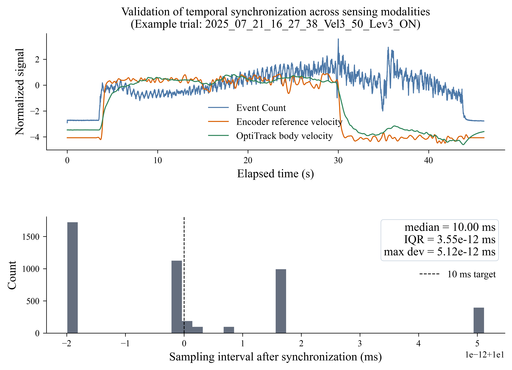
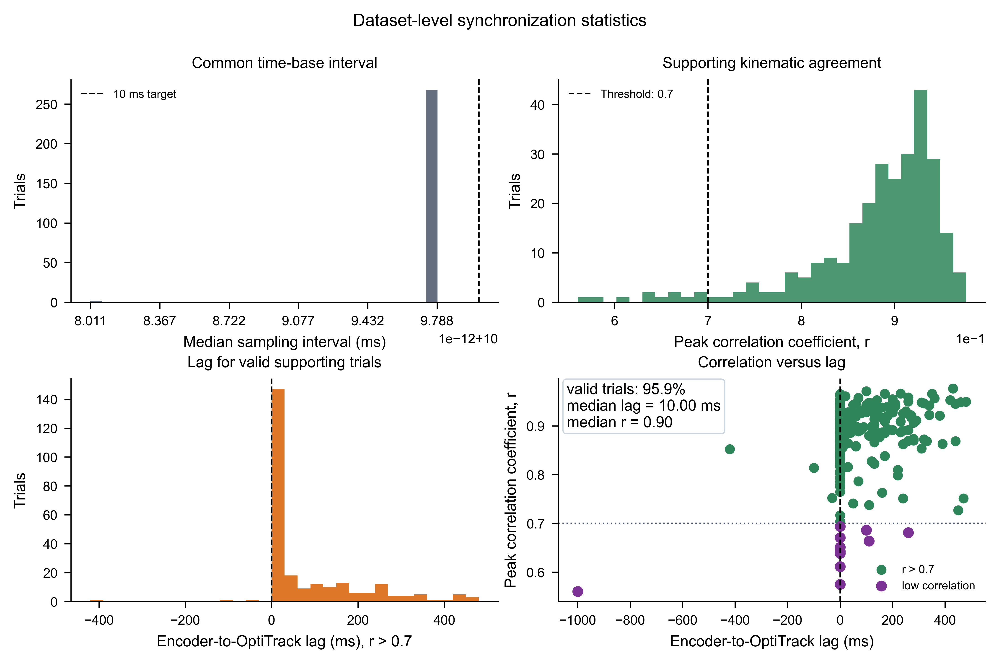
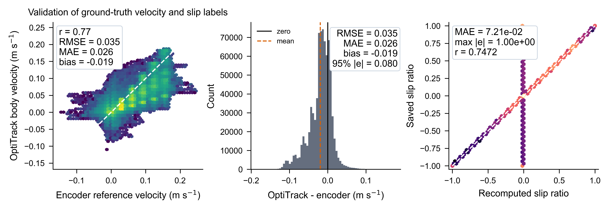
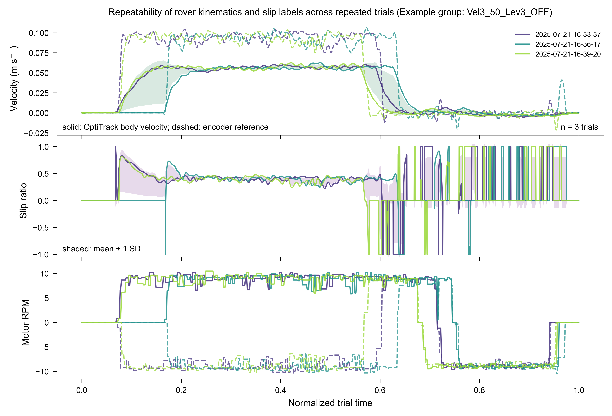
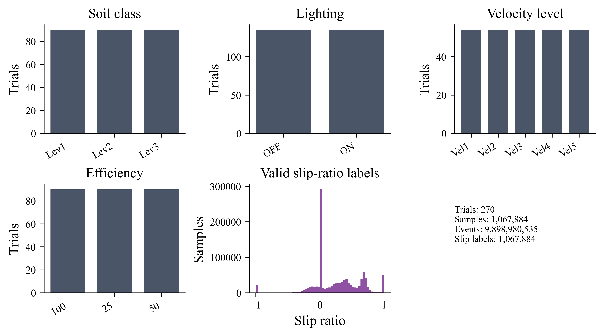

# EBSC_DataAnalysis

This repository provides tools for analyzing EBSC rover HDF5 data, validating the processed dataset, generating event-based frames, and correcting camera image distortion using calibration parameters.

## Repository Structure

- `EBSC_DataAnalysis.py`: Main script for processing rover HDF5 data, generating plots, and saving analysis results.
- `EBSC_PrepareDataset.py`: Script for converting raw EBSC HDF5 recordings into synchronized processed dataset files.
- `EBSC_Validation.ipynb`: Notebook for validating the processed EBSC HDF5 dataset and generating manuscript-ready validation figures.
- `EBSC_FramesGenerator.py`: Script for generating grayscale event-based time-surface frames from event camera data in HDF5 files.
- `undistort_images.py`: Script for undistorting images using camera calibration parameters from a `.mat` file.
- `CalibParameters_struct.mat`: Example MATLAB calibration file containing camera intrinsics and distortion coefficients.
- `validation_figures/`: Generated dataset-validation figures and CSV metric summaries.
- `README.md`: Documentation and usage instructions.

---

## Requirements

Install the Python dependencies:

```sh
pip install numpy scipy pandas opencv-python h5py tqdm plotly kaleido matplotlib jupyter
```

The validation notebook expects processed `.h5` files with datasets such as `events`, `Opti_pos`, `Opti_vel`, `Opti_ori`, `Opti_ori_rate`, `vel_body_xy`, `motor_rpm`, `ref_velocity`, and `slip`.

---

## Dataset Validation Figures

The repository includes selected validation outputs under `validation_figures/`. These figures summarize synchronization, ground-truth consistency, repeatability, and dataset coverage.

### Sensor synchronization



This figure compares event counts, encoder reference velocity, and OptiTrack body velocity on the common 10 ms time base for an example trial. It also reports the synchronized sampling interval distribution.

### Dataset-level synchronization summary



This figure summarizes time-base consistency, encoder-to-OptiTrack correlation, lag distribution, and correlation-versus-lag behavior across the dataset.

### Ground-truth and slip-label validation



This figure checks slip-label coverage across wheel-efficiency and soil conditions, and compares encoder-derived reference velocity against OptiTrack body velocity.

### Repeatability example



This figure overlays repeated trials from the same command group after alignment, showing OptiTrack body velocity, encoder reference velocity, longitudinal slip, and motor RPM.

### Dataset coverage statistics



This figure summarizes trial coverage by soil class, lighting condition, velocity level, efficiency condition, and valid slip-ratio labels.

The same figures are also saved as `.pdf` and `.svg` files for publication use. Supporting CSV files include:

- `validation_figures/dataset_trial_summary.csv`
- `validation_figures/sensor_synchronization_metrics.csv`
- `validation_figures/sensor_synchronization_dataset_summary.csv`
- `validation_figures/ground_truth_validation_metrics.csv`
- `validation_figures/repeatability_metrics.csv`
- `validation_figures/dataset_statistics_summary.csv`

---

## Usage

### 1. Dataset Preparation (`EBSC_PrepareDataset.py`)

Use this script to prepare the processed dataset used by the validation notebook and frame-generation script. It reads raw HDF5 recordings, synchronizes the sensors onto a common event-camera time base, computes derived labels, saves diagnostic plots, and writes one processed `.h5` file per trial.

#### Input format

Each raw input file is expected at:

```text
path_to_h5/<h5_file_name>.h5
```

The script expects these HDF5 groups and datasets:

- `events/data`: event camera data with columns `[x, y, polarity, timestamp]`.
- `opti_pos/data`: OptiTrack position and quaternion data.
- `opti_pos/time`: OptiTrack ROS timestamps.
- `motor_speed/data`: motor RPM data.
- `motor_speed/time`: motor ROS timestamps.

#### Steps

1. Edit the constants and paths in `EBSC_PrepareDataset.py`:

   ```python
   window_size = 0.01
   wheel_radius = 0.1
   half_rover_length = 0.29
   half_track_width = 0.22348
   save_images = True

   output_dir = r"Path\To\Output\\"
   path_to_h5 = r"Path\To\H5\\"
   h5_file_list = [
       "2025_07_17_17_19_17_Vel1_Lev3_ON",
   ]
   ```

   - `window_size`: synchronized output sampling interval in seconds. The default `0.01` creates a 100 Hz processed dataset.
   - `wheel_radius`, `half_rover_length`, and `half_track_width`: rover geometry constants used to compute encoder reference velocity.
   - `save_images`: set to `True` to save diagnostic PNG plots for each trial.
   - `output_dir`: root folder where processed trial folders will be created.
   - `path_to_h5`: folder containing the raw `.h5` files.
   - `h5_file_list`: raw file names to process, without the `.h5` extension.

2. Run the script:

   ```sh
   python EBSC_PrepareDataset.py
   ```

#### Processing performed

- Converts event timestamps to seconds relative to the first event.
- Builds a common 10 ms event time grid.
- Resamples OptiTrack position/orientation and motor RPM onto the common grid.
- Applies Kalman filtering to OptiTrack position and quaternion orientation.
- Computes inertial velocity, body-frame velocity, angular velocity, motor RPM, encoder reference velocity, longitudinal slip ratio, and lateral slip angle.
- Low-pass filters the encoder-derived reference velocity.

#### Output

For each trial, the script creates:

```text
output_dir/
  <h5_file_name>/
    <h5_file_name>.h5
    <h5_file_name>_Position.png
    <h5_file_name>_Velocity.png
    <h5_file_name>_Ori.png
    <h5_file_name>_BodyVelocity.png
    <h5_file_name>_MotorRPM.png
    <h5_file_name>_Slip.png
    <h5_file_name>_LateralSlip.png
    <h5_file_name>_ReferenceVelocity.png
```

The processed HDF5 file contains:

- `events`
- `Opti_pos`
- `Opti_vel`
- `Opti_ori`
- `Opti_ori_rate`
- `vel_body_xy`
- `motor_rpm`
- `ref_velocity`
- `slip`

These processed files are the expected input for `EBSC_Validation.ipynb` and `EBSC_FramesGenerator.py`.

---

### 2. Data Analysis (`EBSC_DataAnalysis.py`)

This script reads rover data from HDF5 files, analyzes position, velocity, orientation, slip, and motor RPM, and saves high-quality plots.

#### Steps

1. Edit paths and file names in `EBSC_DataAnalysis.py`:
   - Set `output_dir` to your desired output folder.
   - Set `path_to_h5` to the folder containing your `.h5` data files.
   - Update `h5_file_list` with the filenames, without the `.h5` extension, that you want to process.

2. Run the script:

   ```sh
   python EBSC_DataAnalysis.py
   ```

#### Output

Plots are saved in subfolders under `output_dir`, including position, velocity, orientation, slip, and motor RPM figures.

---

### 3. Dataset Validation (`EBSC_Validation.ipynb`)

Use this notebook to validate a processed EBSC dataset and regenerate the figures and CSV summaries in `validation_figures/`.

#### Steps

1. Start Jupyter:

   ```sh
   jupyter notebook
   ```

2. Open `EBSC_Validation.ipynb`.

3. In the configuration cell, set:

   ```python
   PROCESSED_DATA_DIR = Path(r"PATH_TO_PROCESSED_DATASET")
   FIGURE_DIR = Path("validation_figures")
   ```

   `PROCESSED_DATA_DIR` should point to the folder containing the processed `.h5` files. The files can be directly inside this folder or inside one subfolder per trial.

4. Optional: configure repeated-trial groups.

   The notebook auto-discovers repeat groups by trial suffix, such as `Vel1_Lev3_ON`. To force a specific group, add trial names to `REPEATABILITY_GROUPS`:

   ```python
   REPEATABILITY_GROUPS = {
       "Vel1_Lev3_ON": [
           "2025_07_17_17_19_17_Vel1_Lev3_ON",
           "2025_07_21_10_22_29_Vel1_Lev3_ON",
           "2025_07_21_10_43_41_Vel1_Lev3_ON",
       ]
   }
   ```

5. Run all cells from top to bottom.

#### What the notebook checks

- Event timestamp monotonicity and common 10 ms time-grid consistency.
- Sensor synchronization using event counts, encoder reference velocity, and OptiTrack body velocity.
- Ground-truth consistency between encoder-derived reference velocity and OptiTrack body velocity.
- Slip-label coverage across soil classes and wheel-efficiency conditions.
- Repeatability across trials with the same command suffix.
- Dataset-level coverage by soil class, lighting, velocity level, and efficiency condition.

#### Output

The notebook saves PNG, PDF, and SVG figures plus CSV metric tables under `validation_figures/`.

---

### 4. Event-Based Frame Generation (`EBSC_FramesGenerator.py`)

This script generates grayscale event-based time-surface frames from the `events` dataset in each processed experiment HDF5 file. The expected event format is `[x, y, polarity, timestamp]`.

The current script scans this layout:

```text
PUBLISHED_ROOT/
  <exp_id>/
    <exp_id>.h5
```

It writes frames to:

```text
FRAMES_ROOT/
  <exp_id>/
    S1_undistorted/
      frame_0001.png
      frame_0002.png
      ...
```

#### Steps

1. Edit the configuration section in `EBSC_FramesGenerator.py`:

   ```python
   PUBLISHED_ROOT = r"PATH_TO_PUBLISHED_EXPERIMENTS"
   FRAMES_ROOT = r"PATH_TO_FRAMES_DIRECTORY"

   TAU = 0.4
   WINDOW_SIZE = 0.01
   REPRESENTATION = "GRAY"
   ```

   - `PUBLISHED_ROOT`: root folder containing one subfolder per experiment.
   - `FRAMES_ROOT`: output folder where generated frames will be written.
   - `TAU`: exponential decay constant for the event-driven time surface.
   - `WINDOW_SIZE`: time window in seconds between generated frames. The default `0.01` generates frames at 100 Hz.
   - `REPRESENTATION`: currently configured for grayscale EDTS frames from positive-polarity events.

2. Run the script:

   ```sh
   python EBSC_FramesGenerator.py
   ```

#### Output

For each experiment, the script reads the HDF5 `events` dataset, generates S1 grayscale EDTS frames, and saves them as numbered PNG files in `FRAMES_ROOT/<exp_id>/S1_undistorted/`.

#### Notes

- The script uses chunked HDF5 reading to handle large event datasets.
- Events are sorted by timestamp before frame generation.
- Frame saving uses multiprocessing to speed up PNG writing.
- If an experiment does not contain an `events` dataset, the script logs a warning and skips it.

---

### 5. Image Undistortion (`undistort_images.py`)

This script uses camera calibration parameters to undistort images.

#### Steps

1. Edit paths in `undistort_images.py`:
   - Set `mat_path` to the path of your calibration `.mat` file, for example `CalibParameters_struct.mat`.
   - Set `img_path` to the path of your distorted image.

2. Run the script:

   ```sh
   python undistort_images.py
   ```

#### Output

The undistorted image is saved with `_undistorted.png` appended to the original filename.

#### Notes

The calibration `.mat` file must contain either `K` or `IntrinsicMatrix` for camera intrinsics, and `RD`/`RadialDistortion` and `TD`/`TangentialDistortion` for distortion coefficients.

---

## Example

Suppose you have:

- Calibration file: `CalibParameters_struct.mat`
- Distorted image: `distorted_image.png`
- Processed dataset root: `Published_Dataset/Dataset`
- Experiment file: `Published_Dataset/Dataset/2025_07_17_17_19_17_Vel1_Lev3_ON/2025_07_17_17_19_17_Vel1_Lev3_ON.h5`

Set the paths in the relevant script or notebook and run the workflow you need:

- Use `EBSC_PrepareDataset.py` to convert raw HDF5 recordings into synchronized processed dataset files.
- Use `EBSC_DataAnalysis.py` for exploratory analysis plots.
- Use `EBSC_Validation.ipynb` for dataset validation figures and metrics.
- Use `EBSC_FramesGenerator.py` for event-frame generation.
- Use `undistort_images.py` for camera image undistortion.

---

## Troubleshooting

- If dataset preparation fails while reading a raw file, verify that the raw HDF5 file contains `events/data`, `opti_pos/data`, `opti_pos/time`, `motor_speed/data`, and `motor_speed/time`.
- If the prepared dataset has unexpected values, verify the rover geometry constants and motor sign convention in `compute_ref_velocity`.
- If no HDF5 files are found in the validation notebook, verify that `PROCESSED_DATA_DIR` points to the processed dataset root.
- If validation loading fails, verify that the HDF5 dataset names match the expected processed-dataset names.
- If frame generation skips a file, verify that the file contains an `events` dataset with columns `[x, y, polarity, timestamp]`.
- If PNG frame generation is slow, reduce the number of experiments processed at once or run on a machine with more CPU cores and disk throughput.
- If image undistortion fails, verify that the calibration `.mat` file contains the required intrinsics and distortion fields.

---

## Copyright

Copyright © 2025 KHALIFA UNIVERSITY FOR SCIENCE & TECHNOLOGY (KU) and the Technology Innovation Institute (TII). All rights reserved.

---

## Contact

For questions or support, please contact Hazem Elrefaei.
